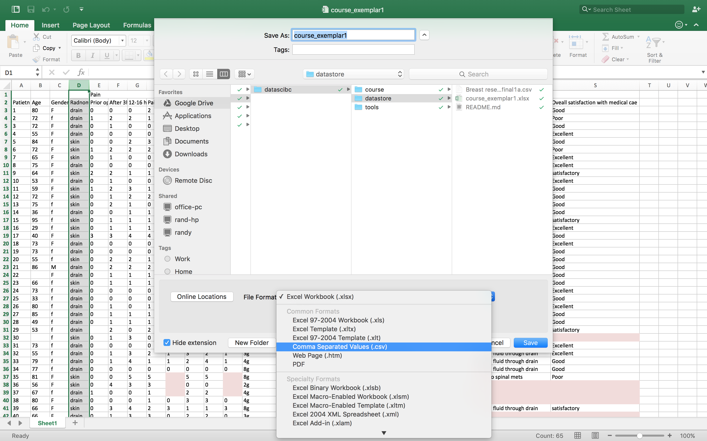

<!-- rename file with the lesson name replacing template -->

## Learning Objectives 

Getting Data into R can be accomplished in many ways.

1. Get data out of your spreadsheet
2. Click and import using R studio
3. Scripting your import (and file paths)
4. Using GoogleSheets

## Lesson 

## Everything is a "data-frame"

Once you have imported any sheet into R, the result is a data-frame. This is another word for a sheet - like Excel's sheet; it has columns, each identified by a name, and rows for observations.

To access a dataframe's particular column, we use the $ notation. E.g:

```{r}
df$some_column
```

Here, `df` is our dataframe and the column name is "some_column".

Let's try some coding exercises

```{r}
#Let's look at some data that comes with R
data()

#Let's pick one to play with
x <- iris

#Have a look at the data
View(x)
```

### Exercise: Taking a quick look at the data

a) What are the names of the columns? Hint: try `names()`

b) Display in the console the items in the column `Sepal.Lengths`

c) What is the mean of and standard deviation of `Sepal.Lengths`?

d) What is the median, interquartile range, min and max of `Sepal.Lengths?`

e) Can you do the same for all the other columns in `x`?

## Introducing the CSV

CSV, a Comma Seperated Values, is a file that will contain your data. This is easily exportable from Microsoft Excel, Apple Numbers, Open Office, Google Sheets...etc.

It's a simple format. The top line are the column names, each seperated by a comma. The following lines are the observations in those columns, again, seperated by a comma.

It's strength is in it's simplicity. It only has data, no formuals, no tricks and is very well recognised amongst software packages as it is very easily supported. R has excellent support for CSV.

## Export CSV From Excel



## Find your File

You will need to know the absolute location of your file on your harddrive.


## File your File
This will result in the following path:

```{r}
/Users/ahmedalhindawi/Documents/Development/Man_graph.xls
```

On Windows: Shift+Right click on file. Choose Copy As Path. A similar path will appear.

## Using in-built function

We can import Comma Separated Values (CSV) files into R very easily. These files can be generated by Microsoft Excel, Apple Numbers and Google Sheets usually through a File -> Export process.

Once a sheet has been exported, it can be imported into R:


```{r}
FILE <- "/Users/ahmedalhindawi/Documents/Development/Man_graph.xls"
df <- read.csv(FILE, header=TRUE, stringsAsFactor=FALSE)
```

This will read your file, then a dataframe object will be available to run queries on. To display the entire column, type:

```{r}
df$column_name
```


## Exercises

### Questions

### Answers


---

[Previous topic]() --- [Next topic]()


