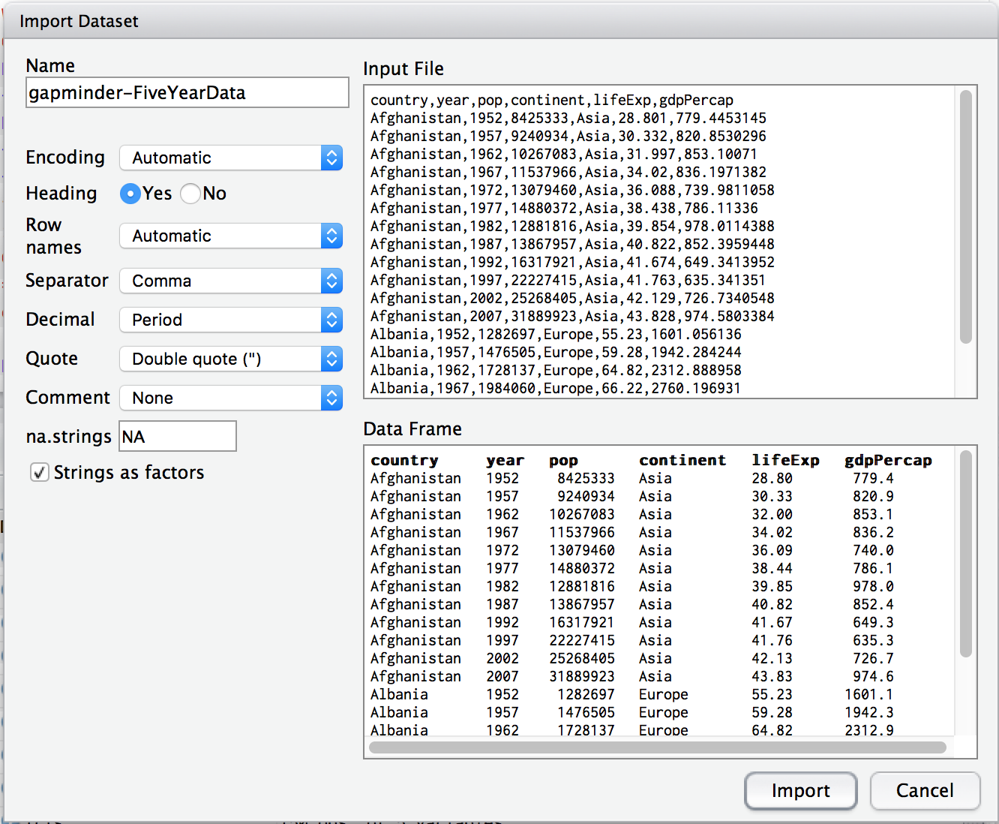
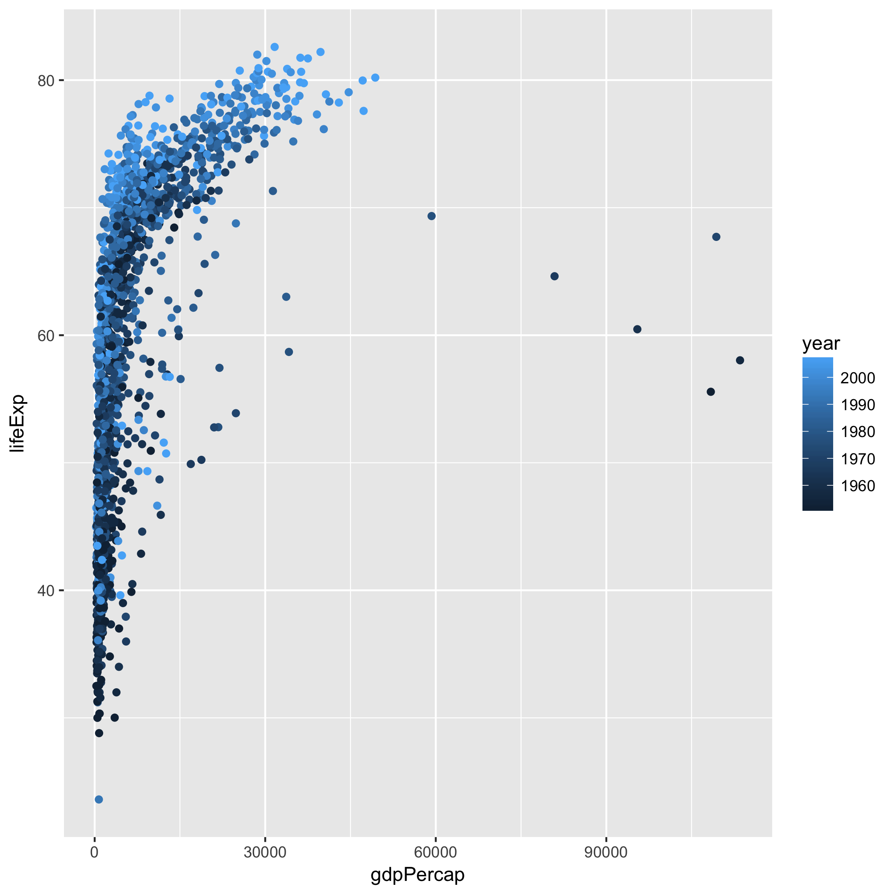
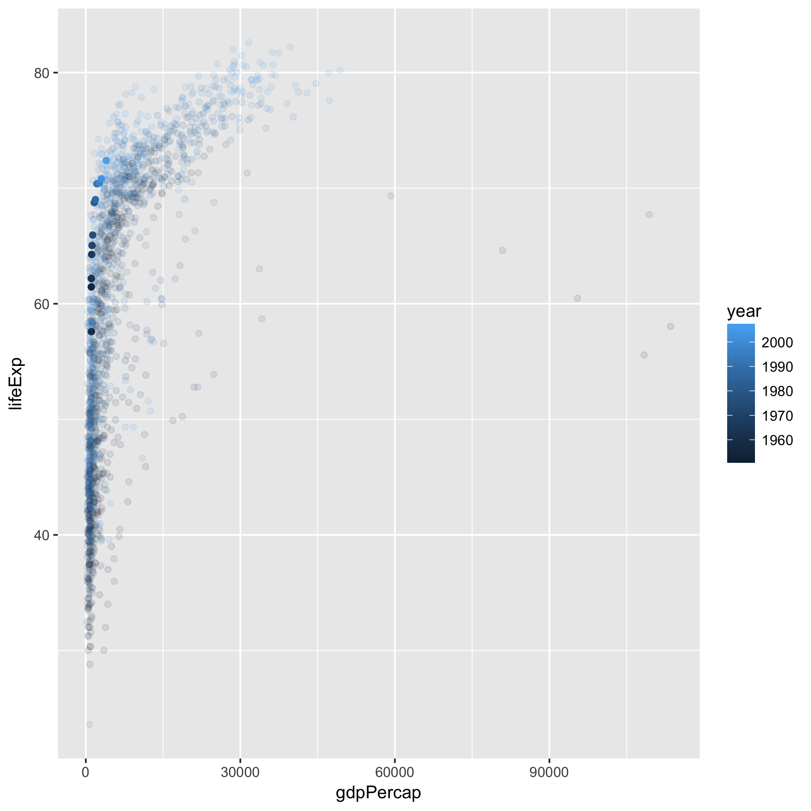
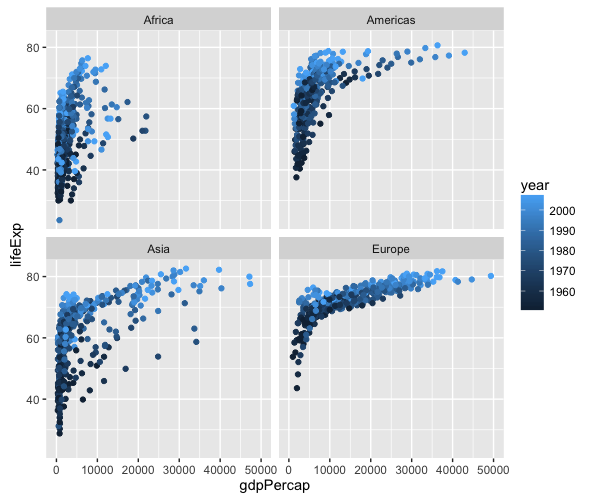

<!-- - [ ] TODO(2016-05-19): factors and lists -->

## Learning Objectives

- [Get your hands dirty](#follow-me)

## Lesson

<a name="follow-me"></a>

### Get your hands dirty

Congratulations. That was the most 'conceptual' part of the course. Now time to get your hands dirty!

See if you can follow along. We'll type in the code together.

Load some data from [GapMinder](http://www.gapminder.org).

```
ddata <- read.csv(file="https://raw.githubusercontent.com/resbaz/r-novice-gapminder-files/master/data/gapminder-FiveYearData.csv")
```

Tricky to type? First, grab the link from Slack.

- then click on the 'Environment' tab, and find and click the 'Import Dataset button'. Then select the 'From Web URL...' option
- or save the file to you machine, follow the same steps, but select the 'From Local File...' option

Then change the 'name' you are giving to these data to `ddata` (see top left box).



To see the first few rows, type `head`

```
head(ddata)
```

We have data for 142 countries from 5 continents over 60 years.

```
      country year      pop continent lifeExp gdpPercap
1 Afghanistan 1952  8425333      Asia   28.80     779.4
2 Afghanistan 1957  9240934      Asia   30.33     820.9
3 Afghanistan 1962 10267083      Asia   32.00     853.1
4 Afghanistan 1967 11537966      Asia   34.02     836.2
5 Afghanistan 1972 13079460      Asia   36.09     740.0
6 Afghanistan 1977 14880372      Asia   38.44     786.1
```

## A quick tour of data Wrangling

### Prerequisite

- Install the packages:
    + `dplyr`
    <!-- + `lubridate`  -->
    <!-- + `stringr` -->

```r
install.packages("dplyr")
library(dplyr)
```

### First wrangle (picking rows)

Type this into the console:

```r
filter(ddata, country == "Sri Lanka")
```

Done! It _filters_ rows from the `ddata` data frame where `country` is  equal to `Sri Lanka`.

## Comparisons in R (and most other languages too!)

- Most are obvious:
    + `>` (greater than), `>=` (greater than or equal to), and similarly for `<` and `<=`.
- Others are less so:
    + `!=` means Not Equal to...
- Others are confusiong:
    + `==` compares equality. Notice that there are two equal signs. This is because in R `=` means an assigment, you're _making_ somethign equal to something else:
    + `x = 6` means make the variable called `x` equal 6. If you then do `x == 8` is a question, _is_ x equal to 8? Here, the answer is a `FALSE`

## Second Wrangle (picking a column)!

Select the life expectancy (`lifeExp`) column (but for all countries)


```r
select(ddata, lifeExp)
```


## What's that weird sign?!

```r
ddata %>% filter(country == "Sri Lanka") %>% select(lifeExp)
```

The `%>%` operator (created by the _dplyr_ library) is called a **pipe**, and it (surprise, surprise) _pipes_ data from one command to the next. So in plain English, the above line _filters_ the data where the `Country` is `Sri Lanka` and then selects `lifeExp`.


## What now?

Now that we have our data's _subset_, we can pass it onto other functions in R:

```r
ddata %>% filter(country == "Sri Lanka") %>% select(lifeExp) %>% summary
```

This says, grab my data labeled `ddata`, filter the rows (for Sri Lanka)  select life expectancy, and report a summary.

## What do you think this does?

```r
ddata %>% filter(country == "Sri Lanka" | country == "United Kingdom") %>% group_by(country) %>% summarise(mean(lifeExp))
```

We're guessing that although you have never seen this command before, you know that it will report the mean age by country. The nice thing about this is that it is very readable.

> **Exercise:** Can you report the median and IQR for the population of Sri Lanka and the UK?

```r
ddata %>% filter(is.na(Age) == FALSE, age >= 65) %>% select(gender)
```

Load a plotting library called `ggplot2` (The `gg` refers to a famous book by William Cleveland called the 'Grammar of Graphics').

## Data visualisation

```
library(ggplot2)
```

We will use the `ggplot()` function from the **ggplot2** library for plotting. This function needs to be told what data to use, which variable to put on the x-axis, and which on the y-axis. Things like the x-postion, the y-postion, the size and the colour of points are called `aesthetics` in the grammar of graphics.

Let's plot life expectancy against wealth (GDP).

```
ggplot(data=ddata, aes(x=gdpPercap, y=lifeExp))
```

OK? No! Nothing happened. Aren't functions supposed to do something? In this case, ggplot prepares the data for the graph. Now you need to `tell` ggplot what sort of graph you want.

Let's make a scatter plot. You must tell ggplot what sort of plot (called a 'geometry') you want. Let's make a scatter plot.

```
ggplot(data=ddata, aes(x=gdpPercap, y=lifeExp)) + geom_point()
```



Want to see how this varies by continent? Try 'facetting' which means drawing mini-plots for each group.

```
ggplot(data=ddata, aes(x=gdpPercap, y=lifeExp)) + geom_point() + facet_wrap(~continent)
```

What about how things change over time? Add a new aesthetic (colour) for the `year` variable.

```
ggplot(data=ddata, aes(x=gdpPercap, y=lifeExp, colour=year)) + geom_point() + facet_wrap(~continent)
```

> **Exercise:** Can you highlight Sri Lanka within this plot? Try ...

```
ggplot(data=data.4c, aes(x=gdpPercap, y=lifeExp, colour=year)) +
  geom_point(aes(alpha=ifelse(country=='Sri Lanka',1,0.2))) +
  guides(alpha=FALSE)
```



Would you like to make the plots easier to read by hiding the outliers?

```
ggplot(data=ddata, aes(x=gdpPercap, y=lifeExp, colour=year)) + geom_point() + facet_wrap(~continent) + coord_cartesian(x=c(0,50000))
```


And drop Oceania (there's not much data). We'll use another library called 'dplyr' that allows us to 'filter' the data easily.

> **TIP:** the `!=` operator means 'not equal to' so the statement below could be read as assign the name `data.4c` to the data made by filtering out all rows where the continent is _not equal_ to 'Oceania'.

```
library(dplyr)
data.4c <- filter(ddata, continent!="Oceania")
```

Now plot with the _updated_ data.

```
ggplot(data=data.4c, aes(x=gdpPercap, y=lifeExp, colour=year)) + geom_point() + facet_wrap(~continent) + coord_cartesian(x=c(0,50000))
```



Cause for optimism? Or just home time? You have finished. See you next week.


---

## Exercises

## Questions

1. Can you explain the difference between the console and the source panes in R studio?
2. In RStudio, have a look in the _Environment_ tab of the pane on the top right? What do you think is shown here?
3. Try using the help function to find out what `ls()` does. Hint: try typing this in the search box of the _Help_ pane. Don't worry if the 'help' doesn't make much sense! Or just type `?ls` in the console.


## Home work (!)

Type the following (you'll need a working internet connection).

```
install.packages("swirl")
library(swirl)
swirl()
```

This brings up an interactive R lesson. Choose either R Programming then either option 1 or 2.

    | Please choose a course, or type 0 to exit swirl.

    1: R Programming
    2: Take me to the swirl course repository!

    Selection: 1

    | Please choose a lesson, or type 0 to return to course menu.

     1: Basic Building Blocks      2: Workspace and Files        3: Sequences of Numbers
     4: Vectors                    5: Missing Values             6: Subsetting Vectors
     7: Matrices and Data Frames   8: Logic                      9: Functions
    10: lapply and sapply         11: vapply and tapply         12: Looking at Data
    13: Simulation                14: Dates and Times           15: Base Graphics


<!-- - [ ] TODO(2016-05-12): change working directory (point and click, console) -->
