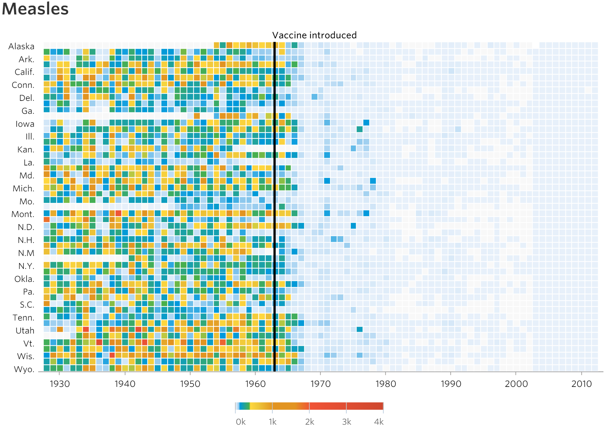

<!-- rename file with the lesson name replacing template -->

<!--## Learning Objectives -->

<!--     

* aesthetics in ggplot
* Revisit ggplot with all the nicer options for facetting, colour size
        - [ ] maybe get them to plot hrate and mortality with sample size etc
        - [ ]

 -->

## Data Visualisation

We all enjoy seeing the fruits of our labour. So lets see what we can do to turn our data into a great visualisation. Before making your data vis, here are a few general rules that can maximise the impact of your data:
- Minimise clutter
- Use the right chart to express your data
- Use the full space of your canvas
- Make sure any text used is kept to a minimum and is readable
- Avoid misleading scales

- Use colour effectively

- Try to ask a lay person if they can follow the chart - if they can, it's a good sign

Here's a demonstration of how to declutter a column chart (sorry, this one isn't clustered).

## Which chart?

Here's a useful guide, courtesy of [Extreme Presentations](http://extremepresentation.typepad.com/files/choosing-a-good-chart-09.pdf).

## ggplot2

R handles graphs well. However, a library called ggplot2 was written that takes this to a whole new level. It's syntax is a little different, but easy to grasp.

data + geoms + co-ordinate system = chart
ggplot(data = d, aes(x=x, y=y)) + geom_box()

## Exercises

1. Take the data from gapminder, and produce a graph using ggplot2

### Questions

### Answers

---

[Previous topic](05-lesson-05-just-enough-statistics.html)
